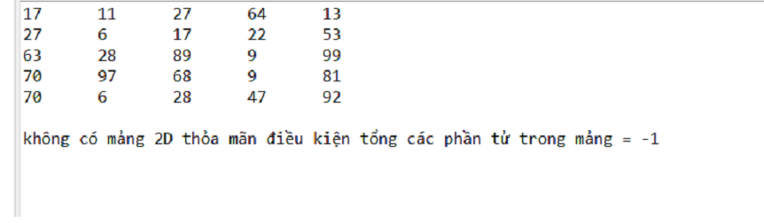

# Introduction. 
1. You must install git base for win, ubuntu or macos you used. 
2. Open your GIT Bash terminal then type " git clone https://github.com/Minglee2018/JavaSubjects.git ".
 + If you don't have GIT Bash you can download [Here]( https://gitforwindows.org/)
then follow  [Tutorial](https://www.atlassian.com/git/tutorials/install-git)
3. hope you like it. If you have any problem lets pull issues for me. Thank you!. 

# Example
Bài 1: bỏ.
	
Bài 2:  lọc ra các phần tử của mảng mà có giá trị nhỏ hơn giá trị trung bình của nó (lọc thông thấp trong xử lý ảnh)

Bài 3: cho mảng 2 chiều với kích thước m, n bất kì. Tìm tập hợp của tất cả các mảng 2 chiều từ mảng ban đầu mà có tổng giá trị bằng 1 giá trị m nào đó cho trước

Bài 4: cho 1 mảng bất kì hãy sắp xếp tại 1 cột nào đó theo thứ tự tăng dần hoặc giảm dần nhưng phải đảm bảo tịnh tiến giá trị theo dòng tương ứng. 

Bài 5: cho một chuỗi string nhập từ bàn phím, in ra n số lượng từ trong chuỗi nhập vào, với n nhập từ bàn phím. Nếu n nhỏ hơn số từ trong chuỗi thì in thêm "....". 

Bài 6: nhập vào một chuỗi các từ cách nhau bởi dấu '#' thống kê các từ có trong chuỗi. 

# Bài 2. 
### Ý tưởng. 
Cộng tất cả phần tử của mảng rồi chia cho rows*cols tính được phần tử TB, phần tử nào lớn hơn or bằng phần tử TB thì gán = 0.
### giải thích code
Khởi tạo rows và cols, sinh ngẫu nhiên ra mảng 2D. 
- phần code chỗ implement programs. Duyệt qua toàn bộ mảng tính tổng các giá trị của mảng lưu vào biến avg. 
- lấy biến avg chia cho tổng phần tử của mảng. 
- Duyệt qua toàn bộ mảng nếu phần tử nào lớn hơn avg thì gán = 0. Ngược lại giữ nguyên. 

# Bài 3. 
### Ý tưởng:
 - Dùng thuật toán đệ quy quay lui để thử tất cả trường hợp, sau đó Chọn các phần tử của mảng ban đầu sao cho tổng chúng bằng M cho trước. 
### Giải thích code:  
- khởi tạo rows = 5 và cols = 5, M = 100; 
- khởi tạo 2 mảng: 
	+ mảng arr2D là mảng sinh ngẫu nhiên các giá trị từ 0->100.
	+ mảng markArrays mảng chứa các phần tử 0 có cùng kích thước với mảng arr2D	
 
- Thực thi chương trình hàm solve.
Để cho đơn giản sẽ khởi tạo các biến trên là biến toàn cục (truy cập trong phạm vi toàn class). 
 
- Phần code sinh dữ liệu cho mảng arr2D các giá trị từ 0 đến 100. 
 
- Sinh dữ liệu cho mảng đánh dấu markArrays là các phần tử 0. 

- Tính tổng các phần tử trong mảng được đánh dấu là 1. 
 
- Phần code chọn ngẫu nhiên các phần tử trong mảng ban đầu. 
- kiểm tra hàm check có tổng bằng giá trị M cho trước. 
	+ nếu bằng  thì in ra mảng đó rồi return để dừng việc gọi đệ quy. 
	+ nếu không bằng thì thực hiện việc đệ quy. 
- Thử cột và hàng. 
	nếu cột chưa vượt quá 5 thì tiếp tục thử cột + 1. Nếu đã vượt quá 5 thì thử hàng +1.
- Vòng for ở trong nghĩa là: 
	k = 0 không chọn. 
	k = 1 chọn. 
 
### Output.

- Nếu có nhiều cách sẽ in ra tất cả số cách có thể có : 

- Nếu không có trường hợp nào thỏa mãn thì output sẽ in ra. 

# Bài 4. 
### Ý tưởng. 
- Tìm ra cột cần sort lưu riêng ra 2 mảng giá trị và mảng index. 
- Trong quá trình sort sẽ sort cả giá trị và index. 
- Sau đó từ mảng index lấy ra các hàng tương ứng lưu vào một ma trận mới. 
### Giải thích code.
number_of_sort_col: là cột cần sắp xếp. 

Arr: là mảng data input. 

arr: là mảng chứa cột cần sắp xếp. 

arrIndex: mảng chưa giá trị vị trí của cột cần sắp xếp.

arr2D: là mảng output. 

- Lấy ra giá trị và vị trí cột cần sắp xếp lưu vào 2 mảng arr và arrIndex. 
- sort cả 2 mảng đó. 
- lưu mảng mới theo giá trị mảng vị trí đã sắp xếp. 

 
# Bài 5. 
### Ý tưởng.
 - Chuẩn hóa chuỗi rồi duyệt từ đầu đến cuối đếm dấu cách theo n ( n là số word cần lấy ).
### Giải thích code.
- Chuẩn hóa chuỗi nhập vào. Đếm dấu cách chính là đếm số từ hiện có. Nếu số từ cần đếm bằng với số n thì ko lấy nữa. 
- Nếu trong chuỗi vẫn còn từ thì gán biến oke=True. Kiểm tra biến oke=True thì cộng thêm phần "....". Ngược lại thì ko làm gì cả. 
 
# Bài 6. 
### Ý tưởng. 
- Sử dụng dictionary của Java để xử lý bài toán. Với KEY là word và VALUE là số lần lặp lại của word đó.
### Giải thích code.
- cộng vào đầu và cuối chuỗi dấu '#' đảm bảo ko bị miss từ đầu cuối. 
- duyệt qua toàn bộ chuỗi tạo biến tmp lưu tạm thời. 
	+ Nếu không gặp dấu # thì cứ cộng chuỗi
	+ Ngược lại thì kiểm tra chuỗi tmp không rỗng, Ném vào dict. Kiểm tra từ đó đã có trong dict haychưa gán với value tương ứng. 
	+ Nếu chưa có thì value = 0, ngược lại gán value + 1.  
	+ In ra dict là output cần tìm. 

### End. 
